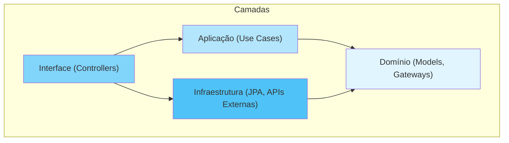

# Arquitetura do Sistema

## Visão Geral

O MKT-GUS segue o padrão **Clean Architecture** (Arquitetura Limpa), separando claramente as responsabilidades em camadas concêntricas.



## Camadas

### 1. Domínio (`domain/`)

**Responsabilidade:** Regras de negócio puras, sem dependências de frameworks.

```
domain/
├── model/           # Entidades puras (Product, Order, Customer, etc)
└── gateway/         # Interfaces para integrações externas
```

**Características:**
- Sem anotações Spring (@Service, @Repository, etc)
- POJOs simples (records ou classes)
- Depende apenas de outras classes do domínio

### 2. Aplicação (`application/`)

**Responsabilidade:** Casos de uso e orquestração.

```
application/
├── usecase/         # Lógica de aplicação (ConfirmPurchase, FindProduct, etc)
├── model/           # DTOs de entrada e saída
└── exception/       # Exceções de negócio
```

### 3. Interfaces (`interfaces/`)

**Responsabilidade:** Adaptadores de entrada (REST API, WebSocket).

```
interfaces/
└── api/
    ├── controller/  # Endpoints REST
    ├── request/     # DTOs de request
    ├── response/    # DTOs de response
    └── mapper/      # Mapeamento entre API e domínio
```

### 4. Infraestrutura (`infrastructure/`)

**Responsabilidade:** Implementações concretas.

```
infrastructure/
├── config/          # Configurações Spring
├── persistence/
│   ├── entity/      # Entidades JPA (com anotações)
│   ├── repository/  # Repositories JPA
│   ├── gateway/     # Implementações de gateways
│   └── mapper/      # Mapeamento Entity ↔ Domain
└── external/        # Integrações externas (Mercado Livre)
```

## Estrutura de Pacotes

```
com.mktgus.autoatendimento/
├── domain/
│   ├── model/          # Product, Order, Customer, Coupon, etc
│   └── gateway/        # ProductCatalogGateway, OrderGateway, etc
├── application/
│   ├── usecase/        # ConfirmPurchaseUseCase, FindProductByBarcodeUseCase, etc
│   ├── model/          # Input/Output records
│   └── exception/      # NotFoundException, ValidationException
├── interfaces/
│   └── api/
│       ├── controller/ # REST Controllers
│       ├── request/    # Request DTOs
│       ├── response/   # Response DTOs
│       └── mapper/     # API Mappers
└── infrastructure/
    ├── config/         # Spring Configs
    ├── persistence/
    │   ├── entity/     # JPA Entities
    │   ├── repository/ # JPA Repositories
    │   ├── gateway/    # Gateway Impls
    │   └── mapper/     # Entity Mappers
    └── external/       # External APIs
```

## Tecnologias

| Camada | Tecnologia |
|--------|------------|
| Backend | Java 21 + Spring Boot 3 |
| Persistência | Spring Data JPA + MySQL |
| API Externa | REST (Mercado Livre) |
| Comunicação | WebSocket (barcode scanner) |
| Frontend | Next.js + TypeScript |

## Princípios Aplicados

1. **Dependência Invertida:** Módulos internos não conhecem externos
2. **Responsabilidade Única:** Cada classe tem uma única razão para mudar
3. **Interface como Contrato:** Gateways definem contratos sem implementação
4. **Separação de Concerns:** UI, lógica e dados em camadas distintas

## Regras de Arquitetura

- ❌ Domínio **não pode** conhecer Spring, JPA ou qualquer framework
- ❌ Use Cases **não podem** ter `@Service` ou `@Transactional`
- ✅ Entidades JPA ficam **sempre** em `infrastructure.persistence.entity`
- ✅ Controllers são **finos** - delegam para Use Cases
- ✅ Mapeamentos explícitos entre camadas