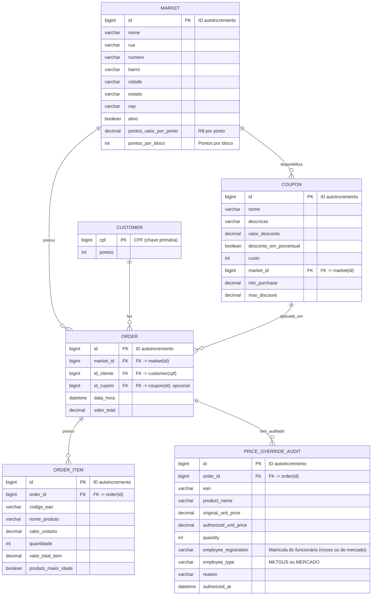

# Database ER Diagram - Modelo Previsto

> Modelo alvo de banco para o projeto, mantendo a mudanca recente de `coupon.market_id`.
>
> ⚠️ No backend atual, parte desse modelo ainda nao esta implementada integralmente.



## Tabelas e Campos

### market
| Coluna | Tipo | Restrições |
|--------|------|-------------|
| id | BIGINT | PK, AUTO_INCREMENT |
| nome | VARCHAR(100) | NOT NULL |
| rua | VARCHAR(150) | |
| numero | VARCHAR(20) | |
| bairro | VARCHAR(100) | |
| cidade | VARCHAR(100) | |
| estado | VARCHAR(50) | |
| cep | VARCHAR(20) | |
| ativo | BOOLEAN | DEFAULT TRUE |
| pontos_valor_por_ponto | DECIMAL | DEFAULT 5.00 |
| pontos_por_bloco | INT | DEFAULT 10 |

### customer
| Coluna | Tipo | Restrições |
|--------|------|-------------|
| cpf | BIGINT | PK |
| pontos | INT | DEFAULT 0 |

### coupon
| Coluna | Tipo | Restrições |
|--------|------|-------------|
| id | BIGINT | PK, AUTO_INCREMENT |
| nome | VARCHAR(50) | NOT NULL |
| descricao | VARCHAR(100) | |
| valor_desconto | DECIMAL | NOT NULL |
| desconto_em_porcentual | BOOLEAN | NOT NULL |
| custo | INT | NOT NULL, mínimo 2 |
| market_id | BIGINT | FK -> market(id) |
| min_purchase | DECIMAL | |
| max_discount | DECIMAL | |

### order
| Coluna | Tipo | Restrições |
|--------|------|-------------|
| id | BIGINT | PK, AUTO_INCREMENT |
| market_id | BIGINT | FK -> market(id), NOT NULL |
| id_cliente | BIGINT | FK -> customer(cpf), nullable |
| id_cupom | BIGINT | FK -> coupon(id), nullable |
| data_hora | DATETIME | NOT NULL |
| valor_total | DECIMAL | NOT NULL |

### order_item
| Coluna | Tipo | Restrições |
|--------|------|-------------|
| id | BIGINT | PK, AUTO_INCREMENT |
| order_id | BIGINT | FK -> order(id), NOT NULL |
| codigo_ean | VARCHAR(50) | Código de barras do produto |
| nome_produto | VARCHAR(255) | Nome do produto (via Mercado Livre) |
| valor_unitario | DECIMAL | Preço unitário |
| quantidade | INT | NOT NULL, DEFAULT 1 |
| valor_total_item | DECIMAL | valor_unitario * quantidade |
| produto_maior_idade | BOOLEAN | DEFAULT FALSE |

### price_override_audit
| Coluna | Tipo | Restrições |
|--------|------|-------------|
| id | BIGINT | PK, AUTO_INCREMENT |
| order_id | BIGINT | FK -> order(id), NOT NULL |
| ean | VARCHAR(64) | NOT NULL |
| product_name | VARCHAR(255) | NOT NULL |
| original_unit_price | DECIMAL | NOT NULL |
| authorized_unit_price | DECIMAL | NOT NULL |
| quantity | INT | NOT NULL |
| employee_registration | VARCHAR(50) | Matrícula do funcionário |
| employee_type | VARCHAR(20) | 'MKTGUS' ou 'MERCADO' |
| reason | VARCHAR(255) | Motivo da alteration de preço |
| authorized_at | DATETIME | NOT NULL |

## Relacionamentos

- **market** 1:N **order** - Cada mercado possui varios pedidos
- **market** 1:N **coupon** - Cada mercado disponibiliza seus cupons
- **customer** 1:N **order** - Um cliente pode estar em varios pedidos
- **coupon** 1:N **order** - Um cupom pode ser usado em varios pedidos; no pedido o vinculo e opcional
- **order** 1:N **order_item** - Um pedido tem vários itens
- **order** 1:N **price_override_audit** - Um pedido pode ter várias auditorias de preço

## Status de Implementacao

- `coupon.market_id` ja foi adicionado ao backend
- a tabela/entidade `market` ainda precisa ser implementada no backend
- `order.market_id` e a validacao de cupom por mercado ainda precisam ser implementados

## Notas

- Produtos **não** são armazenados - vêm da API do Mercado Livre no momento da compra
- Produtos continuam vindo da API do Mercado Livre no fluxo atual

## Lógica de Pontos

### Cálculo de pontos ao confirmar compra:
```java
// Usa configuracao global da aplicacao

// Padrão global: R$ 5 = 1 ponto (bloco de 10 pts = R$ 50)
int pontosGanhos = (valorTotal / taxaPorPonto) * pontosPorBloco;
```

### Configuração padrão (application.yml):
```yaml
pontos:
  valor_por_ponto: 5.0   # R$ 5 = 1 ponto
  pontos_por_bloco: 10     # ganha em bloco
```
